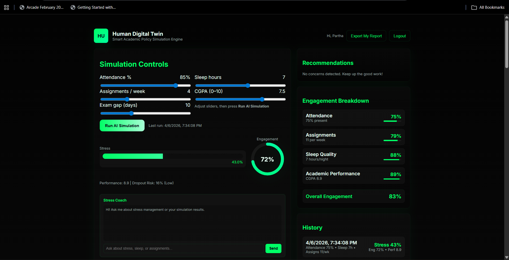
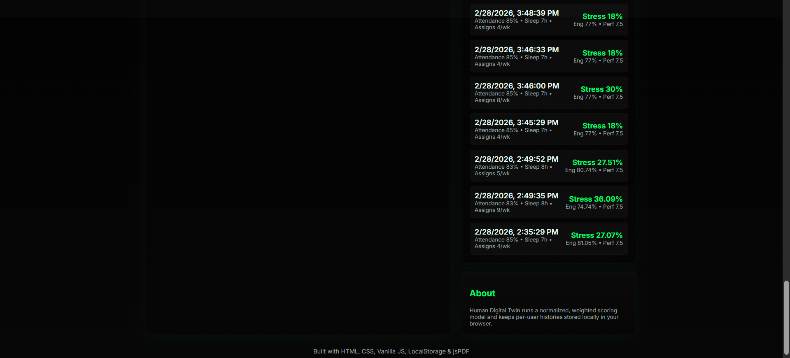

# 🚀 Human Digital Twin  
### Smart Academic Policy Simulation & Dropout Risk Prediction Engine

Human Digital Twin is a **full-stack AI-powered system** that predicts student dropout risk, simulates academic policy changes, and recommends optimization strategies (like sleep adjustment) to improve student well-being and academic stability.

It combines **Machine Learning + Counterfactual Simulation + Interactive Dashboard** to move beyond prediction and provide actionable intervention insights.

---

## 📌 Problem Statement

Educational institutions often increase workload (assignments, assessments, exams) without understanding how it affects:

- Student Stress  
- Engagement Levels  
- Dropout Risk  

Traditional systems only monitor performance using historical data and do not answer:

> **If academic workload increases, how should lifestyle factors be adjusted to maintain stability?**

This project solves that using AI-driven simulation and optimization.

---

## 🎯 Key Features

- 🔮 Dropout Risk Prediction using Machine Learning  
- 📊 Stress and Engagement Analysis  
- 🔁 Counterfactual Simulation ("What-if" Analysis)  
- 😴 Sleep Optimization Recommendation  
- 💡 Smart Recommendation Engine  
- 📈 Interactive Dashboard Visualization  
- 🧾 Local Simulation History Tracking  
- 📄 PDF Report Export  

---

## 🏗️ System Architecture

```text
User Input (Attendance, Sleep, CGPA, Assignments)
            │
            ▼
Frontend Dashboard (HTML/CSS/JS)
            │
            ▼
FastAPI Backend
            │
            ▼
Machine Learning Model (Logistic Regression)
            │
            ▼
Counterfactual Simulation Engine
            │
            ▼
Recommendation Engine
            │
            ▼
Results Dashboard (Stress | Engagement | Risk | Sleep Suggestion)
```

---

## 🛠️ Tech Stack

### Frontend
- HTML5  
- CSS3  
- Vanilla JavaScript  
- SVG (Gauge Visualization)  
- LocalStorage  
- jsPDF  

### Backend
- FastAPI  
- Pydantic  
- Uvicorn  

### Machine Learning
- scikit-learn  
- Logistic Regression  
- NumPy  
- StandardScaler  
- Joblib  

---

## 🤖 Model Used

**Logistic Regression (Binary Classification)**

Used to predict:

- Dropout Probability  
- Risk Percentage  
- Risk Level  
  - Low Risk  
  - Medium Risk  
  - High Risk  

---

## 📂 Dataset Used

The model is trained using:

- `studentInfo.csv`
- `studentVle.csv`
- `studentAssessment.csv`

### Features Engineered
- Studied Credits  
- Virtual Learning Activity (Clicks)  
- Assessment Scores  
- Academic Performance  

### Target
- Dropout (Withdrawn vs Completed)

---

## 🧠 How It Works

1. User inputs:
   - Attendance  
   - Assignments  
   - Exam Gap  
   - Sleep Hours  
   - CGPA  

2. Frontend sends data to backend API.

3. ML model predicts:
   - Dropout risk  
   - Stress  
   - Engagement  

4. Counterfactual engine simulates:

```text
If assignments increase by +1,
how much sleep should increase
to keep risk stable?
```

5. System returns:
- Risk %
- Risk Level
- Recommended Sleep
- Personalized Suggestions

---

## 📊 Example Output

```text
Dropout Risk: 62% (Medium)

If assignments +1 →

Recommended Sleep: 8h
Sleep Increase Needed: +1h
```

---

## 🚀 Installation & Setup

## 1️⃣ Clone Repository

```bash
git clone https://github.com/parthx001/human-digital-twin.git
cd human-digital-twin
```

---

## 2️⃣ Install Dependencies

```bash
pip install fastapi uvicorn scikit-learn numpy joblib
```

---

## 3️⃣ Train Model (First Time Only)

```bash
python train_model.py
```

Generates:

- model.pkl  
- scaler.pkl  

---

## 4️⃣ Start Backend

```bash
uvicorn main:app --reload
```

Open:

```text
http://127.0.0.1:8000/docs
```

---

## 5️⃣ Run Frontend

```bash
python -m http.server 5500
```

Open:

```text
http://localhost:5500
```

---

## 📁 Project Structure

```text
Human-Digital-Twin/
│
├── index.html
├── main.py
├── model.py
├── schemas.py
├── train_model.py
│
├── model.pkl
├── scaler.pkl
│
├── datasets/
│   ├── studentInfo.csv
│   ├── studentVle.csv
│   └── studentAssessment.csv
│
└── README.md
```

---

## 📈 Results

The system successfully:

✔ Predicts student dropout risk  
✔ Estimates stress and engagement  
✔ Simulates academic policy changes  
✔ Recommends sleep optimization  
✔ Provides actionable interventions  

---

## 💡 Unique Contribution

Unlike traditional systems, this project:

- Predicts outcomes  
- Simulates policy changes  
- Optimizes interventions  
- Supports decision-making  

It combines:

- Educational Data Mining  
- Counterfactual Analysis  
- Digital Twin Concept  
- Academic Policy Simulation  

---

## 🎓 Use Cases

- Universities  
- Academic Policy Planners  
- Student Wellness Teams  
- Educational Research  
- AI/ML Hackathons  

---

## 🚀 Future Improvements

- Random Forest / XGBoost models  
- Deep Learning integration  
- Multi-student analytics dashboard  
- LMS Integration (Moodle, Google Classroom)  
- Cloud deployment (Render / AWS)  

---

## 📜 Research Contribution

This project introduces:

- Human Digital Twin in Education  
- Counterfactual Simulation for Academic Policy  
- Prediction + Optimization Framework  

---

## 👨‍💻 Key-features

Developed as a full-stack AI system integrating:

- Machine Learning  
- Backend API Development  
- Interactive Frontend Engineering  

---

## ⭐ One-Line Summary

**An AI-powered academic digital twin that predicts student dropout risk and optimizes lifestyle adjustments using machine learning and counterfactual simulation.**

---

## 🙌 If You Like This Project

Give it a ⭐ on GitHub.


## 📊 Results

### Main Dashboard


### Engagement Breakdown


### Simulation History

